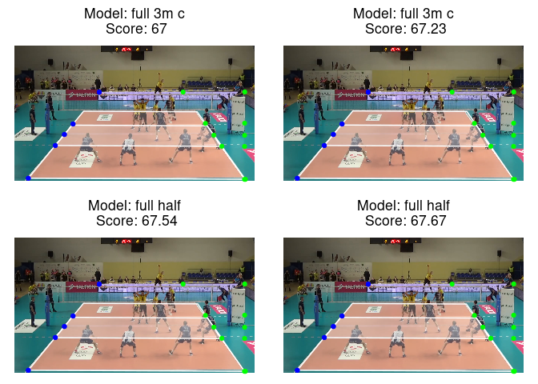

<!-- README.md is generated from README.Rmd. Please edit that file -->

# ovcourt

<!-- badges: start -->
<!-- badges: end -->

Automatic sport court detection suite of functions

## Installation

You can install the development version of ovcourt from
[GitHub](https://github.com/) with:

``` r
## install.packages("remotes") ## if needed
remotes::install_github("openvolley/ovcourt")
```

## Example

This is a basic example which shows you how to solve a common problem:

``` r
library(ovcourt)

image_file <- system.file("extdata/2019_03_01-KATS-BEDS-frame.png", package = "ovcourt")
court_df <- ov_detect_court(image_file = image_file, score_distance = "pattern-based",
                            lambda = 1e3)
ov_detect_court_plot(court_df, index = 1:4, plot.all.endpoints = TRUE)
```


